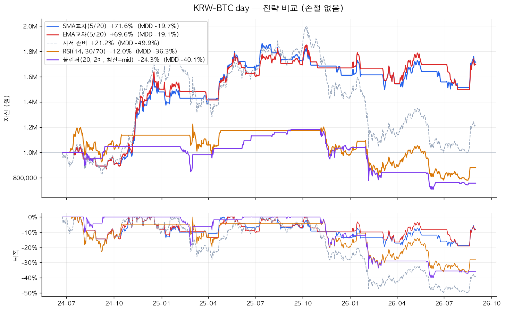
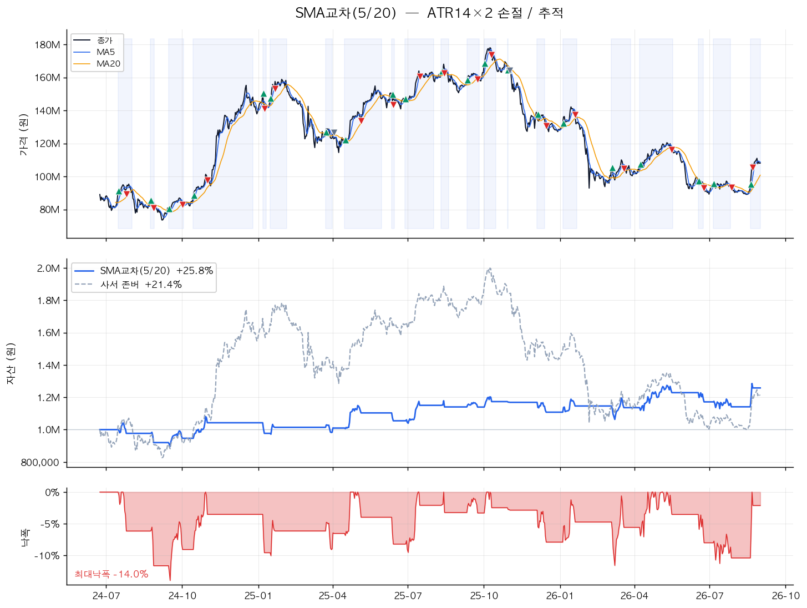

# upbit — 업비트 자동매매 학습 프로젝트

> **목적: 돈 버는 봇이 아니라 공부/포트폴리오용.**
> 실제 돈은 "잃어도 되는 소액"만. 적금·투자 자금은 절대 건드리지 않는다.

시세 수집 → 지표 계산 → 전략 → 백테스팅 → **과최적화 검증** → 소액 실전까지,
자동매매의 전 과정을 직접 구현하고 **테스트로 정직성을 강제한** 프로젝트.



---

## 빠른 시작

```bash
make setup      # 가상환경 + 의존성
make test       # 테스트 96개
make backtest   # 전략 백테스팅
make optimize   # 과최적화 검증 ★
make chart      # 그래프 생성
make bot        # 봇 실행 (모의 — 돈 안 나감)
```

`make` 만 치면 전체 명령 목록이 나온다.

---

## 구조

```
upbit/
├── data.py          OHLCV 수집 + CSV 캐시
├── indicators.py    SMA / EMA / RSI / 볼린저 / MACD / ATR
├── strategies/      전략 (교체 가능 — Strategy 패턴)
│   ├── base.py          인터페이스
│   ├── ma_cross.py      이동평균 교차 (추세추종)
│   ├── rsi.py           RSI 역추세
│   ├── bollinger.py     볼린저밴드 역추세
│   └── buy_and_hold.py  존버 (벤치마크)
├── risk.py          손절 / 익절 / 추적손절
├── backtest.py      백테스팅 엔진 + 성과지표
├── optimize.py      그리드서치 / 홀드아웃 / 워크포워드
├── plotting.py      자산곡선·낙폭 그래프
└── live.py          실전 트레이더 (안전장치 4겹)

scripts/  01_fetch → 02_indicators → 03_backtest → 04_optimize → 05_live → 06_chart
          07_experiments — 문서의 숫자를 생성 (재현 가능)
tests/    96개 — 미래참조·수수료·손절 체결가·실주문 잠금 검증
docs/     실험기록 · 실전준비점검 · 핸드오프 · 이미지 · 데이터 스냅샷
```

### 5단계 매핑

| 단계 | 하는 일 | 파일 | API 키 |
|---|---|---|---|
| 1 | 데이터 수집 | `upbit/data.py` · `scripts/01_fetch.py` | 불필요 |
| 2 | 지표 계산 | `upbit/indicators.py` · `scripts/02_indicators.py` | 불필요 |
| 3 | 매수/매도 규칙 | `upbit/strategies/` | 불필요 |
| 4 | **백테스팅** | `upbit/backtest.py` · `scripts/03_backtest.py` | 불필요 |
| 4.5 | **과최적화 검증** | `upbit/optimize.py` · `scripts/04_optimize.py` | 불필요 |
| — | 손절/익절 | `upbit/risk.py` | 불필요 |
| 5 | 소액 실전 | `upbit/live.py` · `scripts/05_live.py` | **필요** |

### 새 전략 추가

`Strategy`를 상속해 `generate_positions`만 구현하면 백테스터·봇에 그대로 꽂힌다.

```python
from upbit.strategies.base import Strategy, _hold_between

class MyStrategy(Strategy):
    name = "내전략"

    def generate_positions(self, df):
        return _hold_between(entries=..., exits=...)   # 1=보유, 0=현금
```

`tests/test_strategies.py`의 `STRATEGIES` 리스트에 넣으면
"미래참조 없음 / 포지션 이진값 / 워밍업 구간 현금" 공통 규약이 자동 검사된다.

---

## 이 프로젝트가 지키는 원칙

### 1. 미래를 보지 않는다

신호는 **t봉 종가**로 판단하고 체결은 **t+1봉 시가**로 한다.
같은 봉 종가에 사고파는 코드는 실제로 불가능한 거래라 수익률이 부풀려진다.

테스트가 직접 검증한다 — 뒤쪽 가격을 5배로 조작해도 앞쪽 자산곡선이 한 톨도 안 변해야 통과.

### 2. 수수료·슬리피지를 뺀다

업비트 원화마켓 편도 0.05% + 슬리피지 0.05%.
가격이 **전혀 안 움직여도** 매매를 반복하면 잃는다는 걸 테스트로 박아뒀다.

### 3. 손절 체결가를 유리하게 계산하지 않는다

손절은 백테스트 결과를 제일 쉽게 부풀릴 수 있는 지점이다.

- **갭 하락**: 시가가 이미 손절선 아래면 손절가가 아니라 **시가**에 체결된다.
  현실의 스탑은 손절선을 보장하지 않는다.
- **손절·익절이 같은 봉에 닿으면**: 봉 안의 순서를 알 수 없으므로 **손절이 먼저**인 것으로 본다.
- **추적 손절선**은 손절 판정이 끝난 **뒤에** 갱신한다.
  이번 봉 고점으로 손절선을 먼저 올리고 같은 봉에서 판정하면 미래참조다.
- **손절 직후엔 재진입을 막는다.** 전략이 한 번 현금으로 돌아올 때까지.
  안 막으면 손절 다음 봉에 다시 사서 계속 얻어맞는다.

### 4. 훈련 성적을 믿지 않는다

파라미터를 잘게 쪼개 탐색할수록 훈련 성적은 **무조건** 좋아진다.
좋아지는 건 전략이 아니라 '과거를 외운 정도'다.

---

## 실제로 돌려본 결과

> 아래 숫자는 전부 **[docs/실험기록.md](docs/실험기록.md)** 가 출처다.
> 그 문서는 `scripts/07_experiments.py` 가 생성하며, 실험에 쓴 데이터를
> `docs/data/` 에 스냅샷으로 고정해뒀다 — 언제 돌려도 같은 숫자가 나온다.

### 과최적화 — 훈련 성적은 대부분 착시였다

앞 70% 구간에서 36개 파라미터 조합을 탐색해 1등을 고르고, 한 번도 안 본 뒤 30%에 적용:

```
훈련 구간 +93.24%   →   검증 구간 -4.01%
```

훈련 성적이 통째로 사라졌다. 36개 중 1등을 고른 행위 자체가
"그 구간에 제일 잘 맞는 숫자 찾기"였을 뿐이다.

구간을 밀어가며 4번 재최적화(워크포워드)하면 **매번 다른 파라미터가 1등**으로 뽑힌다.
"5/20이 최고"는 고정된 진리가 아니라 그 구간에서 우연히 맞은 숫자다.

### 손절은 수익률과 맞바꾸는 거래다

전략을 SMA교차 5/20으로 고정하고 손절만 바꿔가며:

| 손절 설정 | 총수익률 | MDD | 승률 |
|---|---:|---:|---:|
| 없음 | **+71.6%** | -19.7% | 35.0% |
| 고정 -5% | +65.7% | -23.3% | 35.0% |
| ATR×2 | +62.4% | -22.0% | 35.0% |
| ATR×2 + 추적 | +25.8% | **-14.0%** | 42.9% |



추적손절은 낙폭을 5.7%p 얕게 만드는 대신 수익률을 45.8%p 깎았다.
**승률은 올랐는데(35% → 43%) 수익은 줄었다** — 이익 구간을 일찍 끊었기 때문이다.
추세추종은 소수의 큰 상승으로 먹고 사는데 손절이 그걸 잘라버린다.

어느 쪽이 맞는지는 백테스트가 아니라 "내가 -19.7% 낙폭을 실제로 견디고
안 던질 수 있는가"가 정한다. 못 견딜 것 같으면 손절을 켜는 게 맞다 —
중간에 던지면 +71.6%는 어차피 못 받는다.

## 5단계 실전 — 안전장치

`live.py`는 안전장치를 4겹으로 걸어놨다.

1. **기본이 모의(dry-run)** — 주문을 흉내만 내고 실제로 안 낸다
2. 실주문은 `.env`의 `UPBIT_ALLOW_LIVE=true` **그리고** `--live` 플래그 **둘 다** 필요
3. 1회 주문 금액 상한(`UPBIT_MAX_ORDER_KRW`) — 0 하나 더 붙은 오타 방어
4. 키는 환경변수에서만 읽음 (`.env`는 `.gitignore` 등록)

확인 입력은 안전장치를 통과한 **뒤에** 받고, 비대화형(크론·파이프)에서는 무조건 취소한다.

```bash
cp .env.example .env      # 키 채우기 — 절대 커밋 금지
```

> 📋 **[docs/실전-준비-점검.md](docs/실전-준비-점검.md)** — 실제 돈을 넣기 전에
> 뭐가 더 필요한지 코드를 훑어 정리한 문서. 현재 🔴치명 4건이 미해결이다.

### 실주문 전 체크리스트

- [ ] `make backtest` 로 이 전략을 검증했다
- [ ] `make optimize` 의 **검증 구간** 성적을 봤다 (훈련 성적 말고)
- [ ] 넣는 돈은 전부 잃어도 생활에 지장 없다
- [ ] 적금·투자 자금과 완전히 분리된 돈이다

---

## 알아둘 것

- **"알아서 돈 버는 봇"은 없다.** 진짜 있으면 만든 사람이 조용히 부자 됐지 안 판다.
- 어떤 전략도 항상 이기지 않는다. 봇은 **자동으로 잃기도** 한다.
- 백테스트 결과는 '과거 그 구간에서 그랬다'는 뜻일 뿐, 미래 보장이 아니다.
- 짧은 봉(1·5분)은 노이즈 많고 수수료 자주 나간다. 초보는 `day` / `minute60`.

잃으면 수업료, 잘되면 보너스. **실력·포폴은 무조건 남는다.**

---

## 참고

- **[실험 기록](docs/실험기록.md)** — 위 숫자들의 출처와 재현 방법
- **[실전 준비 점검](docs/실전-준비-점검.md)** — 실제 돈 넣기 전 남은 작업
- 배경과 학습 순서: [docs/업비트-자동매매-핸드오프.md](docs/업비트-자동매매-핸드오프.md)
- 라이브러리: [pyupbit](https://github.com/sharebook-kr/pyupbit)
